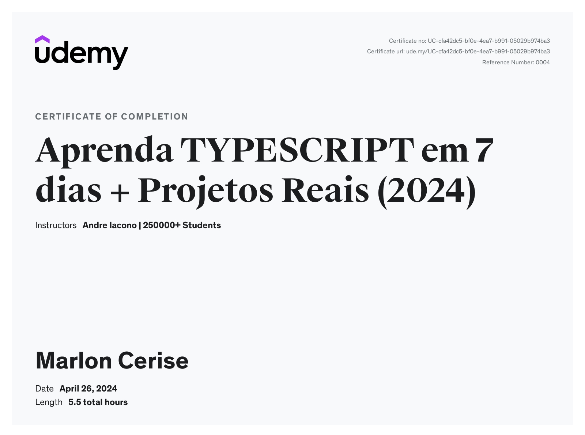

# My TypeScript Course: From Basics to Advanced

Hello! Welcome to the README for my TypeScript Course: From Basics to Advanced. It was an incredible journey to learn and gain proficiency in the concepts of this powerful language. Below, I share what I learned and my certificate of completion.

## What I Learned

- I learned to annotate types for any JavaScript object, providing greater clarity and safety to my code.
- I thoroughly explored the basics of TypeScript's type system, including primitive types, function types, array types, object types, and more.
- I delved into advanced TypeScript concepts such as generics, conditionals, type inference, and advanced type utilities.
- I explored TypeScript interfaces, enabling the definition of clear and reusable contracts between different parts of my code.
- I gained a deep understanding of the use of classes in TypeScript, adding an additional layer of abstraction and organization to my code.
- I explored TypeScript modules and how they can help in organizing and modularizing my project.

## Certificate of Completion

[Certificate of Completion](https://udemy-certificate.s3.amazonaws.com/pdf/UC-cfa42dc5-bf0e-4ea7-b991-05029b974ba3.pdf)

It was an amazing journey, and I am very proud of my progress. Now I am ready to apply my knowledge to real projects and continue growing as a developer. Thank you for joining me on this journey!